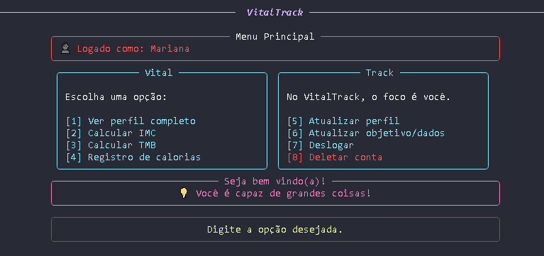
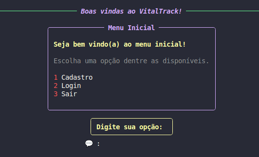
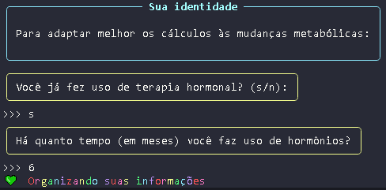

# VitalTrack
- Project for the first term of the Bachelor's Degree in Information Systems.

# Description: 
VitalTrack is an interactive terminal application built in Python to track health and promote wellness habits.
- Core Features: Calorie logging, Body Mass Index (BMI) calculation, Basal Metabolic Rate (BMR) estimation, water intake tracking, and a weekly educational quiz.
- Inclusive by Design: Features a specialized BMR calculator that provides more accurate health monitoring for transgender users, ensuring fairer and more personalized results.

# Technologies used:
- Python 3.13.3

# Python libraries used:
- rich - For advanced formatting in the terminal (colors, panels, stylized text, etc.).
- datetime - For manipulating dates (recording calories per day).
- json - For saving and loading user data in .json files.
- time - For pauses (time.sleep) and loading effects.
- random - For selecting random motivational messages.
- prompt_toolkit - For entering a hidden password (login security).

# Main features:
- ✅ User registration/login, with full CRUD, error flows and validations.
- 📊 BMI and BMR calculation (with support for trans people) and feedback on the user's goal.
- 🔥 Daily calorie log, also integrated into the goals system.
- 💧 Water intake tracking, encouraging proper hydration with daily logs and progress monitoring.
- 📅 Calorie consumption history for the day.
- 💡 Personalized feedback (mass gain, weight loss or maintenance).
- 🧠 Educational quiz, with weekly questions and instant feedback to promote healthy habits.

# Installation
1. Clone the repository:
```
git clone https://github.com/pedroarthur-almeida/projetop1.git
```
2. Install the dependencies:
```
pip install -r requirements.txt
```
3. Execute:
```
python project1.py
```

# Create a virtual environment (recommended):
- In Windows:
```
python -m venv venv
venv\Scripts\activate
```
- On Mac/Linux:
```
python -m venv venv
source venv/bin/activate
```
# Highlights and differentials of VitalTrack:
- Inclusive: Calculations adapted for trans people on hormone therapy.
- Offline: Data saved locally in users.json.
- Intelligent feedback: Personalized tips by objective.

# VitalTrack screenshots:
- Login menu



- Start menu



- Interactions



---
# 🚧 Active development
- This project is under active development and subject to change...
---


  
