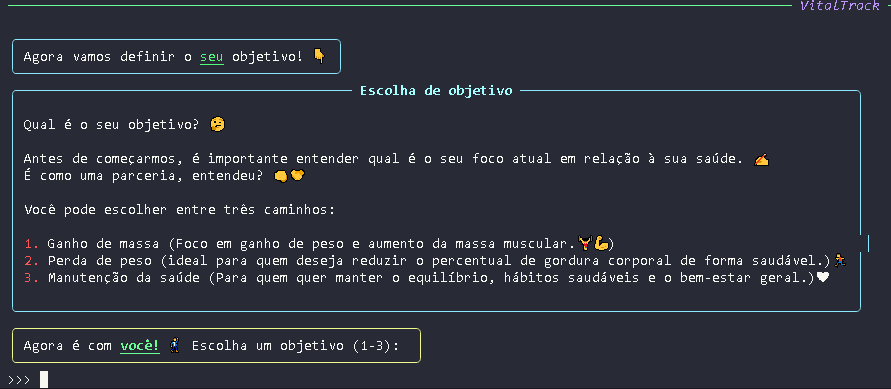

# VitalTrack
- Project for the first term of the Bachelor's Degree in Information Systems.

# Description: 
- VitalTrack is a system developed in Python that offers an interactive terminal interface focused on monitoring health and promoting healthy habits. The program has features such as calorie recording, calculation of Body Mass Index (BMI) and Basal Metabolic Rate (BMR). One of VitalTrack's main differentials is its inclusive nature: the system was designed to take into account information specific to trans people when calculating BMR, promoting fairer and more personalized monitoring. With this, the project seeks to unite technology, health and inclusion in an accessible and efficient tool.

# Technologies used:
- Python 3.13.3

# Python libraries used:
- rich - For advanced formatting in the terminal (colors, panels, stylized text, etc.).
- datetime - For manipulating dates (recording calories per day).
- json - For saving and loading user data in .json files.
- time - For pauses (time.sleep) and loading effects.
- random - For selecting random motivational messages.
- prompt_toolkit - For entering a hidden password (login security).

# Main features:
- ✅ User registration/login, with full CRUD, error flows and validations.
- 📊 BMI and BMR calculation (with support for trans people) and feedback on the user's goal.
- 🔥 Daily calorie log, also integrated into the goals system.
- 📅 Calorie consumption history for the day.
- 💡 Personalized feedback (mass gain, weight loss or maintenance).

# Installation
1. Clone the repository:
```
git clone https://github.com/pedroarthur-almeida/projetop1.git
```
2. Install the dependencies:
```
pip install -r requirements.txt
```
3. Execute:
```
python project1.py
```

# Create a virtual environment (recommended):
- In Windows:
```
python -m venv venv
venv\Scripts\activate
```
- On Mac/Linux:
```
python -m venv venv
source venv/bin/activate
```
# Highlights and differentials of VitalTrack:
- Inclusive: Calculations adapted for trans people on hormone therapy.
- Offline: Data saved locally in users.json.
- Intelligent feedback: Personalized tips by objective.

# VitalTrack screenshots:
- Login menu


- Start menu


- Interactions


- Choice of objective



---
# 🚧 Active development
- This project is under active development and subject to change.
---


  
